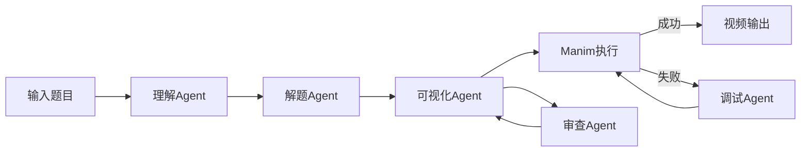

# 小学数学辅导工具

一个基于大模型多Agent技术和Manim库的小学数学辅导工具，能够理解小学数学题目，并生成直观的数形结合可视化视频。

## ✨ 主要特点

- 🧠 **智能分析**：深度理解各类小学数学题目（支持20+题型）
- 📝 **详细解答**：提供清晰的分步解题过程
- 🎬 **可视化演示**：生成数形结合的动画视频，让抽象概念具体化
- 🎯 **技能系统**：基于Anthropic Skills风格的声明式技能库
- 💻 **Web界面**：简洁易用的Streamlit交互界面

## 🏗️ 系统架构

### 多Agent协作系统

```
┌─────────────────────────────────────────────────────────────────┐
│                         Streamlit Web UI                        │
└───────────────────────────────┬─────────────────────────────────┘
                                │
┌───────────────────────────────▼─────────────────────────────────┐
│                        Core Engine                               │
│  ┌──────────────┐  ┌──────────────┐  ┌──────────────────────┐  │
│  │ Understanding │→│   Solving    │→│   Visualization      │  │
│  │    Agent     │  │    Agent     │  │      Agent           │  │
│  └──────────────┘  └──────────────┘  └──────────┬───────────┘  │
│                                                  │               │
│                    ┌─────────────────────────────▼────────┐     │
│                    │         Manim Executor               │     │
│                    │   ┌─────────────────────────────┐    │     │
│                    │   │ Review Agent ←→ Debug Agent │    │     │
│                    │   └─────────────────────────────┘    │     │
│                    └──────────────────────────────────────┘     │
└─────────────────────────────────────────────────────────────────┘
                                │
┌───────────────────────────────▼─────────────────────────────────┐
│                        Skills System                             │
│  ┌─────────────┐  ┌──────────────┐  ┌────────────────────────┐ │
│  │   agents/   │  │   system/    │  │    visualization/      │ │
│  │  (5个提示词) │  │ (推理原则)   │  │    (19个可视化技能)    │ │
│  └─────────────┘  └──────────────┘  └────────────────────────┘ │
└─────────────────────────────────────────────────────────────────┘
```

### Agent职责

| Agent | 职责 | 输入 | 输出 |
|-------|------|------|------|
| 理解Agent | 分析题目，提取关键信息 | 题目文本 | 结构化分析JSON |
| 解题Agent | 生成详细解题步骤 | 分析结果 | 分步解答JSON |
| 可视化Agent | 将解题过程转换为Manim代码 | 解题步骤 | Python代码 |
| 审查Agent | 优化布局和动画效果 | Manim代码 | 优化后代码 |
| 调试Agent | 修复代码执行错误 | 错误信息 | 修复后代码 |

## 📚 技能系统

项目采用类似Anthropic Skills的声明式技能系统，所有提示词和代码模板以Markdown文件形式管理。

### 技能目录结构

```
skills/
├── skill_loader.py          # 技能加载器
└── definitions/              # 技能定义
    ├── agents/               # Agent系统提示词
    │   ├── understanding.md
    │   ├── solving.md
    │   ├── visualization.md
    │   ├── debugging.md
    │   └── review.md
    │
    ├── system/               # 系统级通用原则
    │   └── reasoning.md      # 推理规划框架
    │
    └── visualization/        # 可视化技能库 (19个)
        ├── addition.md           # 加法可视化
        ├── subtraction.md        # 减法可视化
        ├── multiplication.md     # 乘法可视化
        ├── division.md           # 除法可视化
        ├── chicken_rabbit.md     # 鸡兔同笼
        ├── travel_meeting.md     # 行程问题-相遇
        ├── travel_chasing.md     # 行程问题-追及
        ├── sum_difference.md     # 和差问题
        ├── multiple_relation.md  # 倍数问题
        ├── tree_planting.md      # 植树问题
        ├── pattern_finding.md    # 找规律
        ├── perimeter_trick.md    # 巧求周长
        ├── area_transform.md     # 等积变形
        ├── geometry.md           # 几何问题
        ├── comparison.md         # 比较大小
        ├── word_problem.md       # 应用题
        ├── continuous_operation.md # 连续运算
        ├── animation_guidelines.md # 动画规范
        └── quality_validator.md    # 质量检查
```

### 技能优势

- **可维护**：修改提示词只需编辑`.md`文件，无需改代码
- **可扩展**：添加新题型只需创建新`.md`文件
- **可测试**：每个技能可独立测试和验证
- **版本控制友好**：文本格式易于diff和review

## 🛠️ 技术栈

| 组件 | 技术 |
|------|------|
| 大模型 | DeepSeek Chat / 本地模型 (Xinference) |
| Agent框架 | LangChain |
| 可视化 | Manim CE (社区版) |
| Web框架 | Streamlit |
| 语言 | Python 3.10+ |

## 📦 安装与设置

### 前提条件

- Python 3.10+
- FFmpeg (Manim依赖)
- DeepSeek API密钥 或 本地LLM服务

### 安装步骤

```bash
# 1. 克隆仓库
git clone https://github.com/yourusername/math-learning-tool.git
cd math-learning-tool

# 2. 创建虚拟环境
python -m venv venv
source venv/bin/activate  # Windows: venv\Scripts\activate

# 3. 安装依赖
pip install -r requirements.txt

# 4. 配置环境变量
cp .env.example .env
# 编辑 .env 文件设置API地址和密钥
```

### 启动应用

```bash
streamlit run app.py
```

访问 http://localhost:8501

## 📁 目录结构

```
math-learning-tool/
├── app.py                    # Streamlit应用入口
├── config.py                 # 配置文件
├── requirements.txt          # 项目依赖
│
├── agents/                   # Agent实现
│   ├── base.py               # Agent基类
│   ├── understanding.py      # 题目理解Agent
│   ├── solving.py            # 解题Agent
│   ├── visualization.py      # 可视化Agent
│   ├── review.py             # 审查Agent
│   └── debugging.py          # 调试Agent
│
├── core/                     # 核心模块
│   ├── engine.py             # 流程协调引擎
│   ├── agent_coordinator.py  # Agent协调器
│   ├── manim_executor.py     # Manim执行器
│   └── model_connector.py    # 模型连接器
│
├── skills/                   # 技能系统
│   ├── skill_loader.py       # 技能加载器
│   └── definitions/          # 技能定义文件
│       ├── agents/           # Agent提示词 (5个)
│       ├── system/           # 系统原则 (1个)
│       └── visualization/    # 可视化技能 (19个)
│
├── utils/                    # 工具函数
│   └── parser.py             # 结果解析
│
└── media/                    # 生成的媒体文件
    └── videos/
```

## 🔄 工作流程



1. **题目理解**：分析题目类型、提取关键信息
2. **解题过程**：生成详细分步解答
3. **代码生成**：根据技能库生成Manim代码
4. **质量审查**：优化布局、动画效果
5. **视频生成**：执行代码生成MP4视频
6. **错误修复**：失败时自动调试修复

## ⚙️ 配置说明

### 环境变量 (.env)

```bash
# LLM配置
DEEPSEEK_API_BASE=https://api.deepseek.com
DEEPSEEK_API_KEY=your_api_key
DEEPSEEK_MODEL=deepseek-chat

# Manim配置
MANIM_QUALITY=medium_quality  # low/medium/high
MANIM_PREVIEW=False
```

### 扩展技能

添加新的可视化技能：

1. 在 `skills/definitions/visualization/` 创建 `new_skill.md`
2. 遵循技能文件格式（描述、何时使用、代码模板）
3. 技能会自动被加载和识别

## 📄 许可证

本项目采用 MIT 许可证。

## 🙏 致谢

- [LangChain](https://github.com/langchain-ai/langchain) - Agent框架
- [Manim CE](https://github.com/ManimCommunity/manim) - 数学动画库
- [DeepSeek](https://api.deepseek.com) - 大语言模型
- [Xinference](https://github.com/xorbitsai/inference) - 本地模型推理
- [Streamlit](https://streamlit.io) - Web框架
